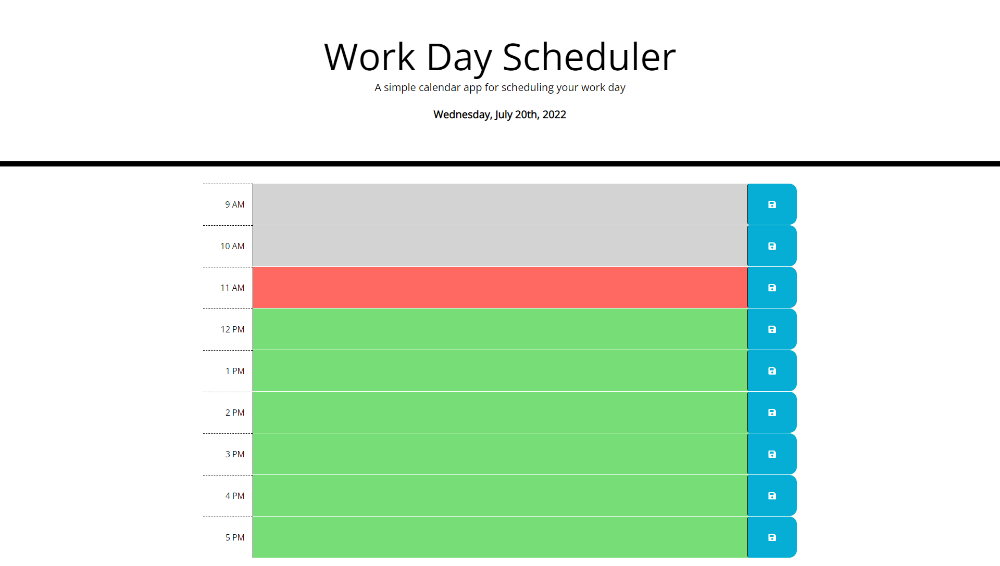

# Work Day Scheduler

This project we were assigned to create a simple calendar application that allows a user to save events for each hour of the day.

## Skills Practiced

- Storing and accessing the local storage
- Using .each to go through multiple elements and assign the same things.
- Use 3rd party APIs
  - Use moment.js to track things in real time.
  - Use bootstrap.js to create grid layout.
  - Use font awesome to get images that scale no matter the resolution.
  - Used jquery to navigate the DOM and assign variables to specific elements.
- Debug using console.log().

## Screenshot of App

## Deployment URL

https://peoplesm.github.io/work-day-scheduler/
